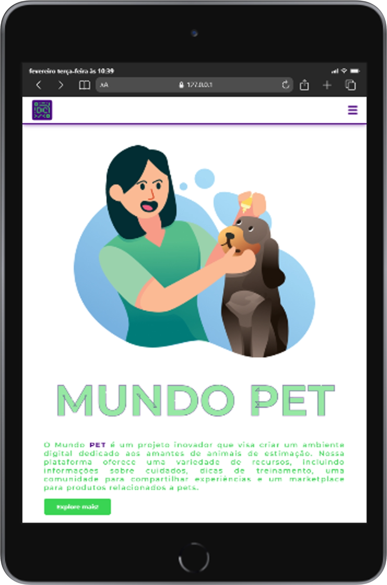
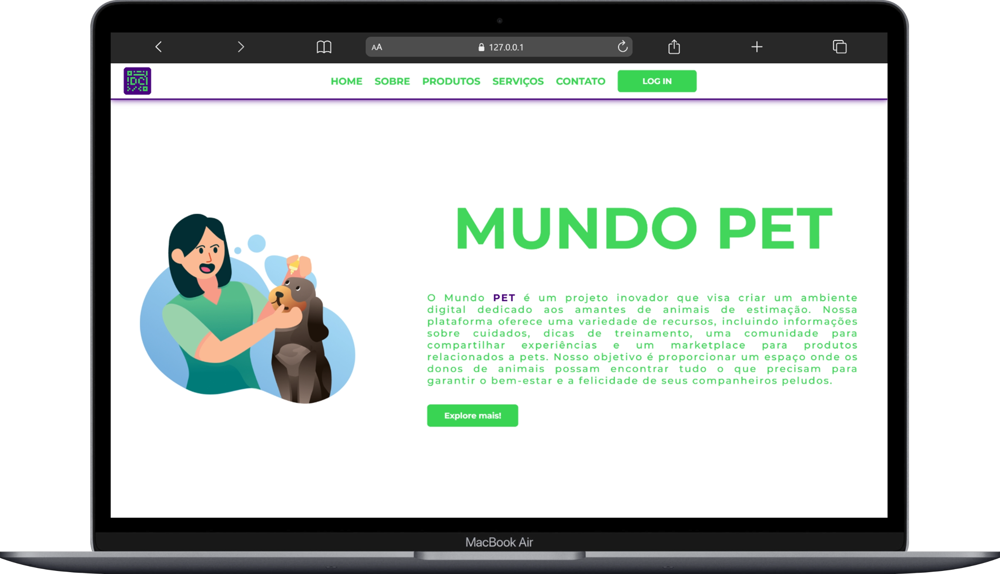
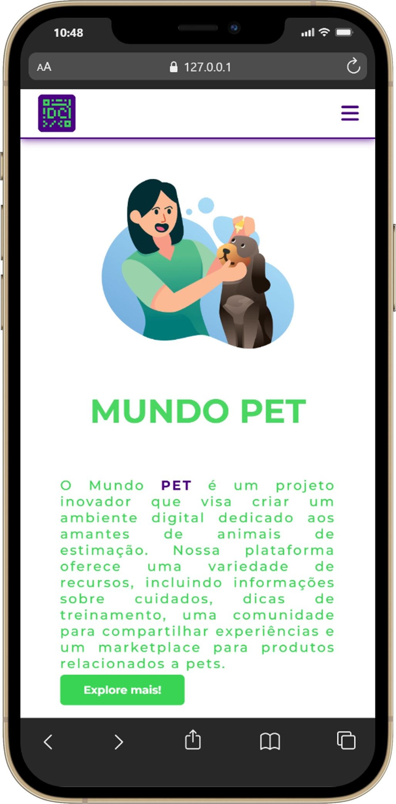

# DevClub — MUNDO PET

**Projeto de estudo (HTML & CSS)** — protótipo de landing page desenvolvido como exercício prático do módulo _HTML e CSS_ do curso Programador Full‑Stack.

---

<div align="center">
  
  
  

  <p style="margin-top:8px;"><small>Arquivos: `tablet.png` &nbsp;|&nbsp; `notbook.png` &nbsp;|&nbsp; `celular.png`</small></p>
</div>

## 📘 Resumo acadêmico

Este repositório contém uma página estática que demonstra aplicação de princípios fundamentais de desenvolvimento front‑end: semântica HTML5, layout com Flexbox, tipografia web, animação SVG via CSS e responsividade por meio de media queries. O trabalho teve como objetivo consolidar técnicas práticas e documentar decisões de design e acessibilidade.

## 🎯 Objetivos

- Aplicar HTML semântico (header, nav, main, section, article).
- Construir um layout responsivo utilizando CSS moderno (Flexbox e media queries).
- Implementar animação visual acessível (SVG + keyframes CSS).
- Seguir boas práticas de organização de código e documentação.

## 🛠️ Tecnologias

- HTML5
- CSS3 (Flexbox, Media Queries, Keyframes)
- Google Fonts: `Montserrat`, `Russo One`
- Font Awesome (ícone de menu)

## 📁 Estrutura do repositório

- `index.html` — marcação semântica da página
- `style.css` — estilos, responsividade e animações
- `README.md` — documentação (este arquivo)
- `Logo-dev-club.png`, `Illustration 2.png`, `tablet.png`, `notbook.png`, `celular.png` — ativos de imagem usados no protótipo

## ▶️ Como executar (ambiente local)

1. Clone o repositório:

```bash
git clone https://github.com/geilsonfreire/1--Projeto-HTML_CSS-DevClub.git
cd 1--Projeto-HTML_CSS-DevClub
```

2. Abra `index.html` em um navegador moderno (Chrome, Firefox, Edge, Safari).

3. Opcional: use a extensão **Live Server** do VSCode para desenvolvimento em tempo real.

> Requisito mínimo: navegador com suporte a CSS modern (Flexbox e custom fonts).

## 🔍 Principais decisões de implementação

- Header fixo com `position: fixed;` — garante acesso à navegação em todos os momentos.
- Tipografia: `Montserrat` para texto e `Russo One` para o título SVG, carregadas via Google Fonts.
- Cores principais: verde `#39d453` (ação/primário) e índigo `#4b0081` (contorno/ênfase).
- Responsividade: breakpoints em `768px` e `480px` para adaptar layout e tipografia.
- Animação SVG: `@keyframes stroke` para efeito de traçado/enchimento no título.

## ♿ Acessibilidade e validação

- Uso de elementos semânticos (`header`, `nav`, `main`, `section`, `article`).
- Imagens com `alt` (verifique conteúdo das imagens para descrições mais detalhadas).

Recomendações imediatas de melhoria:

- Adicionar `:focus` visível para elementos interativos (a11y keyboard navigation).
- Fornecer `aria-label` para o botão de menu e estados toggled (quando implementar JS).
- Respeitar `prefers-reduced-motion` para desativar animações para usuários que solicitam redução de movimento.
- Validar HTML/CSS com ferramentas W3C e executar auditoria Lighthouse.

## 📱 Comportamento responsivo (observações)

- Desktop: layout lado a lado (`section` com imagem + `article`).
- Tablet (≤768px): navegação principal oculta, ícone de menu visível; layout empilhado.
- Mobile (≤480px): tipografia reduzida, espaçamentos ajustados para leitura confortável.

## ✅ Testes sugeridos

- Teste manual de responsividade (320px → 1440px).
- Auditoria com Lighthouse (performance, acessibilidade, melhores práticas).
- Validação W3C (HTML e CSS).

## ⚙️ Limitações e trabalhos futuros

- Menu móvel sem implementação de interação (JS) — adicionar toggle e estados aria.
- Otimização de imagens (`srcset`, WebP) para melhorar performance.
- Implementar temas (modo escuro) e testes de contraste de cores.
- Adicionar formulários e fluxos reais (backend ou mocks) para interatividade.

## 📚 Referências e recursos

- Google Fonts (Montserrat, Russo One)
- Font Awesome (ícones)
- MDN Web Docs — HTML, CSS, Accessibility

## 🤝 Contribuição

Contribuições são bem‑vindas: faça fork, crie uma branch com uma descrição clara e abra um pull request com screenshots e descrição das mudanças.

## 📝 Licença

Licença MIT — consulte o ficheiro LICENSE (ou adicione uma licença apropriada ao projeto).

## 👤 Autor

**Geilson Freire** — desenvolvedor e autor do protótipo.

---

> Observação: este README tem caráter técnico‑acadêmico e descreve decisões de projeto, instruções de uso e sugestões de validação/aperfeiçoamento. Para implementar funcionalidades interativas (menu mobile, formulários) recomendo adicionar um pequeno conjunto de scripts JavaScript e testes unitários/integração.
